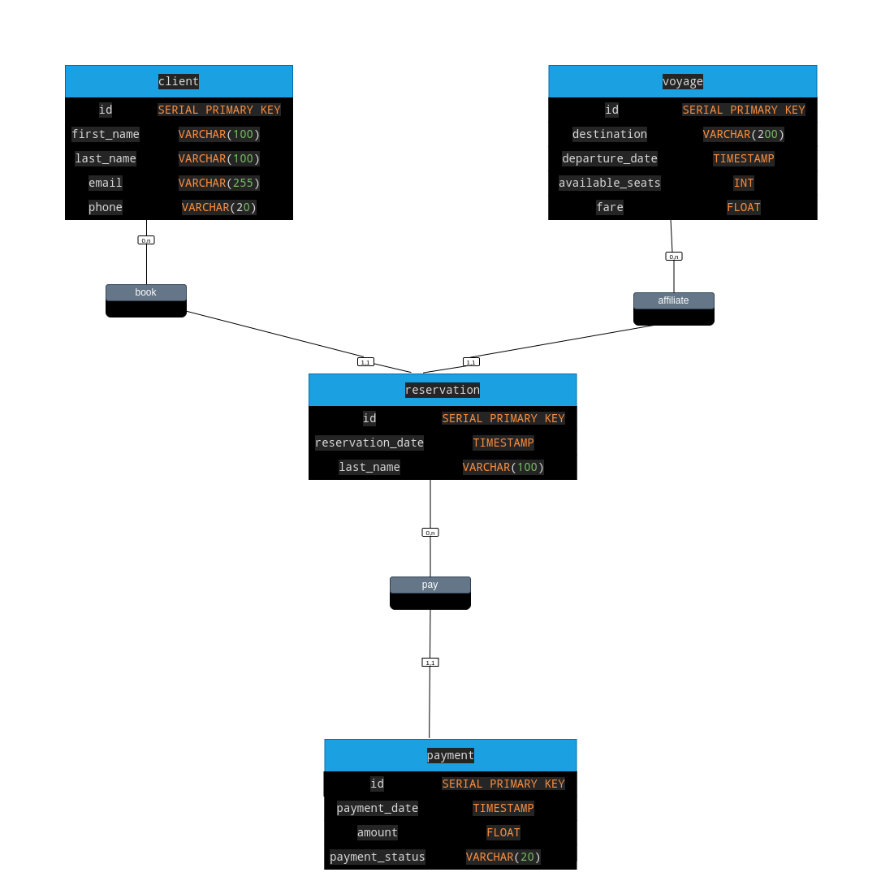

# <p align="center"> MadaTrans</p>

<p align="center">
  
</p>

## <p align="center"> Transport Reservation Management Application </p>

<p align="center"> 
    This application is designed to manage transport reservations for trips. 
    It allows customers to make reservations for various trips.
</p>

## MCD:

<p align="center">
  
</p>

## Technologies Used

- Back-End: Spring Boot, Java
- Database: PostgreSQL
- Front-End: [...]
- Testing: JUnit5

## Installation

1. Clone this repository to your machine.

```sh
https://github.com/Tiana-Finaritra/4-Transport-booking.git
cd 4-Transport-booking
```

## Prerequisites

- Java 17
- Maven [OPTIONAL - Depending on the build tool you're using]
- PostgreSQL    
- JDBC DRIVER

## Above all:
- run the file in "1-database/rundb.sql" in your postgresql terminal to get appropriate database.
- Customize connection information in "2-back-end/src/main/ressources/application.properties".
- Run the rundb.sql file in the 1-database folder to implement the database schema 
and generate dummy data in your local host.
- If you're on vsCode like me: you'll find the manual launch point 
in "2-back-end/src/main/java/MadatransApplication.java".

## OpenAPI-Explorer:
You can see directly the openApi of this project from [swagger UI](https://petstore.swagger.io/?url=https://gist.githubusercontent.com/Tiana-Finaritra/ea2f605bd57a27e27b17c4232ed45763/raw/05f8f2ff5679de8e97849b27a13492848756e49e/openAPI-MadaTrans.yaml)

[Click here:](https://petstore.swagger.io/?url=https://gist.githubusercontent.com/Tiana-Finaritra/ea2f605bd57a27e27b17c4232ed45763/raw/05f8f2ff5679de8e97849b27a13492848756e49e/openAPI-MadaTrans.yaml)

## Liscence:
 Tiana-Finaritra
